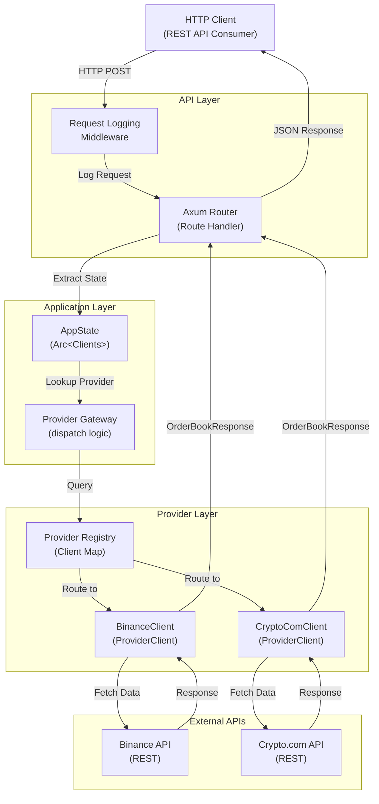
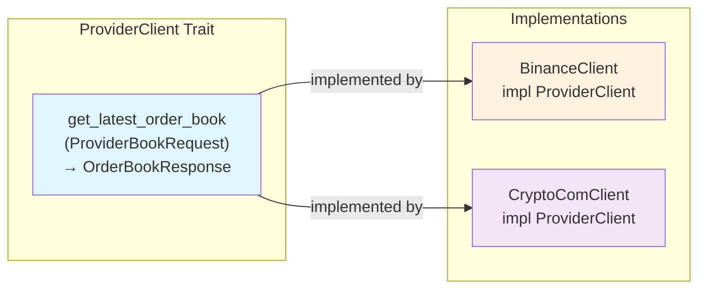
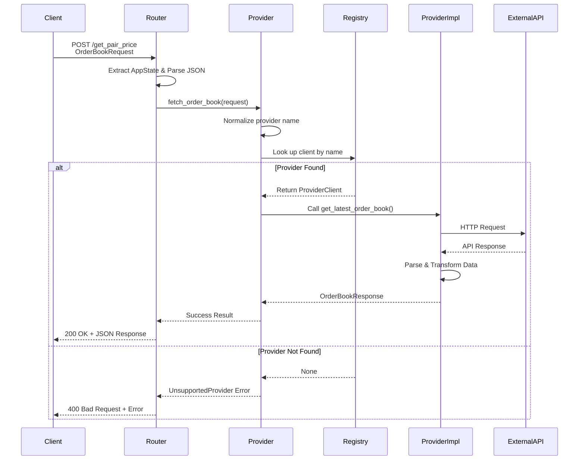
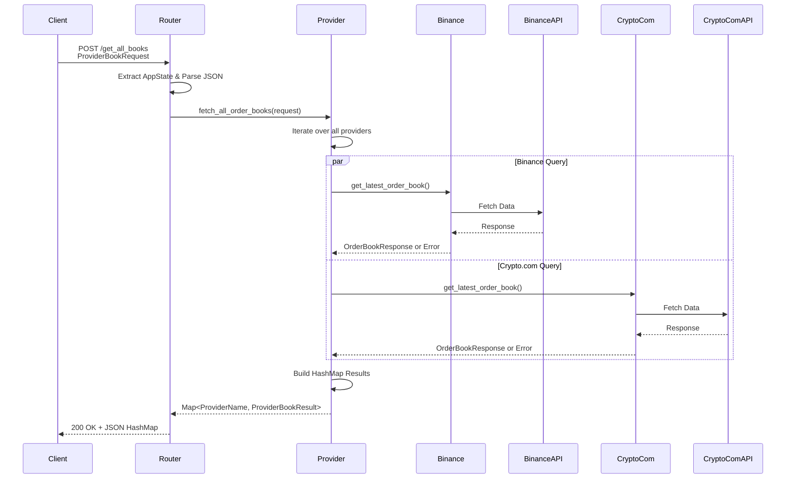

# Crypto Market Connector

A high-performance, multi-provider cryptocurrency order book aggregation API built with Rust and Axum. This service fetches real-time order book data from multiple crypto exchanges (Binance, Crypto.com) through a unified API interface.

## 🎯 Overview

Crypto Market Connector is designed to provide a simple, extensible interface for fetching real-time order book data from multiple cryptocurrency exchanges. It uses a provider-based architecture that makes it easy to add new exchange providers without modifying the core business logic.

**Key Features:**
- 🔄 Multi-provider support (Binance, Crypto.com)
- ⚡ Async/await with Tokio for high concurrency
- 🔌 Extensible provider trait for easy integration of new exchanges
- 📝 Comprehensive structured logging with canonical log crate
- 🛡️ Robust error handling with detailed error messages
- 🚀 Production-ready with proper configuration management

## 🏗️ Architecture

### System Architecture Diagram



### Provider Pattern Architecture



## 📊 Request Flow Diagrams

### Single Provider Request Flow



### Multi-Provider Request Flow



## 📁 Project Structure

```
crypto-market-connector/
├── src/
│   ├── main.rs                 # Application entry point
│   ├── lib.rs                  # Library module declarations
│   ├── app.rs                  # Server setup & initialization
│   │
│   ├── middleware/
│   │   ├── mod.rs             # Middleware module exports
│   │   └── request_log.rs     # HTTP request/response logging
│   │
│   ├── routes/
│   │   ├── mod.rs             # Routes module aggregation
│   │   ├── routes.rs          # API endpoint definitions
│   │   └── pair.rs            # Legacy endpoint (deprecated)
│   │
│   └── services/
│       ├── mod.rs             # Services module exports
│       ├── provider.rs        # Provider registry & dispatch logic
│       ├── types.rs           # Shared types & error definitions
│       │
│       ├── binance/
│       │   ├── mod.rs         # Binance module export
│       │   └── binance_client.rs  # Binance API implementation
│       │
│       └── crypto_com/
│           ├── mod.rs         # Crypto.com module export
│           └── crypto_com_client.rs  # Crypto.com API implementation
│
├── Cargo.toml                  # Rust dependencies & metadata
├── Makefile                    # Build & run commands
├── .env.example               # Example environment variables
└── README.md                  # This file
```

## 🔧 Technology Stack

| Component | Version | Purpose |
|-----------|---------|---------|
| **Axum** | 0.8.9 | Web framework for HTTP routing |
| **Tokio** | 1.52.1 | Async runtime for concurrent operations |
| **Serde** | 1.0.228 | JSON serialization/deserialization |
| **Reqwest** | 0.13.2 | HTTP client for external APIs |
| **Binance SDK** | 46.0.0 | Official Binance API bindings |
| **Log** | 0.4 | Canonical structured logging |
| **Envy** | 0.4.2 | Environment variable loading |
| **Chrono** | 0.4.44 | Date/time formatting |

## 🚀 Getting Started

### Prerequisites

- Rust 1.56+ (2024 edition)
- Cargo package manager
- API credentials for:
  - Binance (API Key & Secret)
  - Crypto.com (API Key & Secret)

### Installation

1. **Clone the repository**
   ```bash
   git clone <repository-url>
   cd crypto-market-connector
   ```

2. **Set up environment variables**
   ```bash
   cp .env.example .env.local
   ```

3. **Configure API credentials**
   Edit `.env.local` with your credentials:
   ```env
   APP_HOST=127.0.0.1
   APP_PORT=8080
   
   BINANCE_API_KEY=your_binance_api_key
   BINANCE_API_SECRET=your_binance_api_secret
   BINANCE_ENV=testnet
   
   CRYPTO_COM_API_KEY=your_crypto_com_api_key
   CRYPTO_COM_API_SECRET=your_crypto_com_api_secret
   CRYPTO_COM_ENV=testnet
   CRYPTO_COM_API_URL=https://uat-api.crypto.com
   ```

4. **Build the project**
   ```bash
   cargo build --release
   ```

5. **Run the server**
   ```bash
   make run-local
   # Or manually:
   cargo run
   ```

The server will start on `http://127.0.0.1:8080`

## 📡 API Endpoints

### 1. Get Order Book from Single Provider

**Endpoint:** `POST /get_pair_price`

**Request Body:**
```json
{
  "provider": "binance",
  "base": "BTC",
  "quote": "USDT",
  "depth": 10
}
```

**Response (Success):**
```json
{
  "provider": "binance",
  "pair": "BTCUSDT",
  "bids": [
    ["42500.00", "1.5000"],
    ["42499.50", "2.0000"]
  ],
  "asks": [
    ["42510.00", "1.2000"],
    ["42510.50", "3.0000"]
  ]
}
```

**Response (Error):**
```json
{
  "error": "unsupported provider: xyz"
}
```

### 2. Get Order Books from All Providers

**Endpoint:** `POST /get_all_books`

**Request Body:**
```json
{
  "base": "BTC",
  "quote": "USDT",
  "depth": 10
}
```

**Response (Success):**
```json
{
  "binance": {
    "success": true,
    "data": {
      "provider": "binance",
      "pair": "BTCUSDT",
      "bids": [...],
      "asks": [...]
    },
    "error": null
  },
  "crypto.com": {
    "success": true,
    "data": {
      "provider": "crypto_com",
      "pair": "BTC_USDT",
      "bids": [...],
      "asks": [...]
    },
    "error": null
  }
}
```

## 📋 Data Types

### OrderBookRequest
Request for fetching order book from a specific provider.

```rust
pub struct OrderBookRequest {
    pub provider: String,      // "binance" or "crypto.com"
    pub base: String,          // Base currency (e.g., "BTC")
    pub quote: String,         // Quote currency (e.g., "USDT")
    pub depth: Option<u32>,    // Market depth (optional)
}
```

### ProviderBookRequest
Internal request format used when dispatching to providers.

```rust
pub struct ProviderBookRequest {
    pub base: String,          // Base currency
    pub quote: String,         // Quote currency
    pub depth: Option<u32>,    // Market depth (optional)
}
```

### OrderBookResponse
Response containing order book data.

```rust
pub struct OrderBookResponse {
    pub provider: String,              // Provider name
    pub pair: String,                  // Trading pair symbol
    pub bids: Vec<(String, String)>,  // Bids: (price, quantity)
    pub asks: Vec<(String, String)>,  // Asks: (price, quantity)
}
```

### ProviderBookResult
Result wrapper for multi-provider requests.

```rust
pub struct ProviderBookResult {
    pub success: bool,
    pub data: Option<OrderBookResponse>,
    pub error: Option<String>,
}
```

### ProviderError
Error types that can occur during order book fetching.

```rust
pub enum ProviderError {
    UnsupportedProvider(String),  // Unknown provider
    InvalidRequest(String),       // Invalid request parameters
    BackendError(String),         // API communication error
}
```

## 🔌 Adding a New Provider

The provider architecture makes it easy to add new exchange providers:

### Step 1: Create Provider Module
Create `src/services/new_exchange/new_exchange_client.rs`:

```rust
use crate::services::provider::ProviderClient;
use crate::services::types::{OrderBookResponse, ProviderBookRequest, ProviderError};

pub struct NewExchangeClient {
    // Client configuration and state
}

impl NewExchangeClient {
    pub fn new() -> Self {
        // Initialize client
    }

    async fn fetch_latest_order_book(
        &self,
        request: ProviderBookRequest,
    ) -> Result<OrderBookResponse, ProviderError> {
        // Fetch from API and transform response
    }
}

impl ProviderClient for NewExchangeClient {
    fn get_latest_order_book(
        &self,
        request: ProviderBookRequest,
    ) -> Pin<Box<dyn Future<Output = Result<OrderBookResponse, ProviderError>> + Send + '_>> {
        Box::pin(async move { self.fetch_latest_order_book(request).await })
    }
}
```

### Step 2: Register in Provider Registry
Update `src/services/provider.rs`:

```rust
impl Clients {
    pub fn new() -> Self {
        let mut client_map: HashMap<String, Box<dyn ProviderClient + Send + Sync>> = HashMap::new();
        
        client_map.insert("binance".to_string(), Box::new(BinanceClient::new()));
        client_map.insert("crypto.com".to_string(), Box::new(CryptoComClient::new()));
        client_map.insert("new_exchange".to_string(), Box::new(NewExchangeClient::new()));
        
        Self { client_map }
    }
}
```

### Step 3: Update Module Exports
Update `src/services/mod.rs` to include the new module.

## 🔍 Logging

The application uses the canonical `log` crate for structured logging. Log levels include:

- **ERROR**: Critical failures requiring attention
- **INFO**: Important application events (startup, provider initialization)
- **DEBUG**: Detailed operational information (request details, provider lookups)

Enable logging by setting the `RUST_LOG` environment variable:

```bash
RUST_LOG=debug cargo run
RUST_LOG=info cargo run
```

Log output example:
```
INFO - Loading server configuration from environment variables
INFO - Successfully loaded configuration: host=127.0.0.1, port=8080
INFO - Initializing provider clients registry
DEBUG - Adding Binance client to registry
DEBUG - Adding Crypto.com client to registry
INFO - Server successfully started and running on 127.0.0.1:8080
```

## 🧪 Testing

### Build
```bash
cargo build
```

### Check for errors
```bash
cargo check
```

### Run tests (when implemented)
```bash
cargo test
```

### Format code
```bash
cargo fmt
```

### Lint
```bash
cargo clippy
```

## 📊 Configuration

### Environment Variables

| Variable | Default | Description |
|----------|---------|-------------|
| `APP_HOST` | `127.0.0.1` | Server host address |
| `APP_PORT` | `8080` | Server port |
| `BINANCE_API_KEY` | Required | Binance API key |
| `BINANCE_API_SECRET` | Required | Binance API secret |
| `BINANCE_ENV` | `testnet` | Binance environment (testnet/production) |
| `CRYPTO_COM_API_KEY` | Required | Crypto.com API key |
| `CRYPTO_COM_API_SECRET` | Required | Crypto.com API secret |
| `CRYPTO_COM_ENV` | `testnet` | Crypto.com environment |
| `CRYPTO_COM_API_URL` | Required | Crypto.com API base URL |
| `RUST_LOG` | `info` | Logging level (debug/info/warn/error) |

### Production Considerations

When deploying to production:

1. **Security:**
   - Use environment variables for all sensitive credentials
   - Store API keys securely (use secrets management service)
   - Enable HTTPS/TLS for all API endpoints
   - Validate and sanitize all inputs

2. **Performance:**
   - Configure appropriate worker thread counts
   - Implement connection pooling
   - Add caching layer if needed
   - Monitor response times

3. **Reliability:**
   - Set up health check endpoints
   - Implement circuit breakers for external APIs
   - Add retry logic with exponential backoff
   - Monitor error rates and alerts

4. **Monitoring:**
   - Set up structured logging aggregation
   - Monitor API response times
   - Track error rates by provider
   - Alert on service issues

## 🐛 Troubleshooting

### "Failed to load binance configuration"
- Verify `BINANCE_API_KEY` and `BINANCE_API_SECRET` are set in environment
- Check environment file is properly sourced

### "Unsupported provider" error
- Verify provider name is lowercase: "binance" or "crypto.com"
- Check that the provider is registered in `Clients::new()`

### API Connection Failures
- Verify Internet connectivity
- Check API credentials and permissions
- Verify API URLs are accessible
- Check rate limits haven't been exceeded

### Parsing Errors
- Verify the external API response format
- Check if the API schema has changed
- Review logs for detailed error messages

## 📝 Error Handling

The API returns descriptive error messages to help with debugging:

```json
{
  "error": "backend error: crypto.com error code=50001 method=get_book message=INVALID_INSTRUMENT"
}
```

Error categories:
- **Unsupported Provider**: The requested provider doesn't exist
- **Invalid Request**: Request parameters are malformed or invalid
- **Backend Error**: External API communication or data processing failed

## 🔐 Security

- ✅ API credentials loaded from secure environment variables
- ✅ Request logging without exposing sensitive data
- ✅ Error messages don't leak internal implementation details
- ✅ Input validation on all request parameters
- ⚠️ HTTPS recommended for production deployments

## 📦 Dependencies

See `Cargo.toml` for complete dependency list. Key dependencies:

- **axum**: High-performance async web framework
- **tokio**: Async runtime for Rust
- **serde/serde_json**: JSON serialization
- **reqwest**: HTTP client
- **binance-sdk**: Official Binance API bindings
- **log/env_logger**: Logging infrastructure

## 📄 License

[Add your license here]

## 🤝 Contributing

[Add contribution guidelines here]

## 📞 Support

For issues and questions, please open an issue on the repository.

---

**Last Updated:** April 25, 2026  
**Status:** Production Ready ✅
